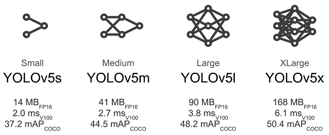
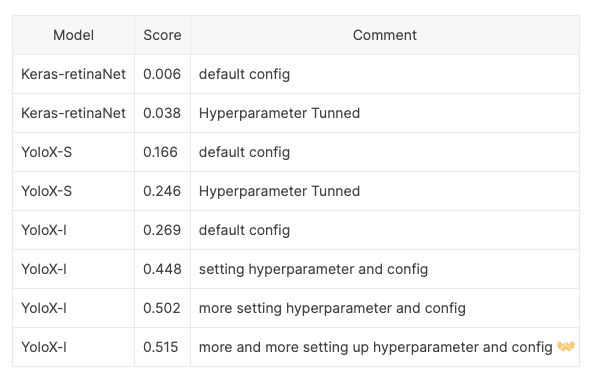
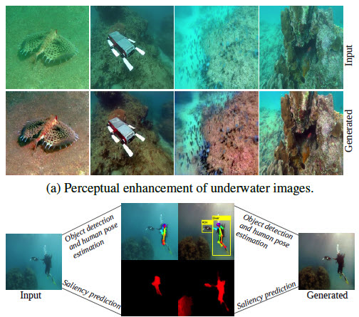

# luweiteng
friendship across years

# 比赛名称：Tensorflow - Help Protect the Great Barrier Reef

www.kaggle.com/c/tensorflow-great-barrier-reef

比赛类型：计算机视觉、目标检测

## 评价指标
这场比赛是在不同交集的联合 (IoU) 阈值的F2 分数上进行评估的。

该指标以 0.05 的步长扫描 0.3 到 0.8 范围内的 IoU 阈值，计算每个阈值的 F2 分数。

## Timeline

2022年2月7日 - 报名截止日期。
2022年2月14日 - 最终提交截止日期。

# 参考

本次比赛可以算一个小目标检测任务，且检测模型需要有较高的精度。在本次比赛中比较适合的模型是：

* YOLOV5
* YOLOX

具体模型的预测细节可以参考：

`www.kaggle.com/remekkinas/yolox-inference-on-kaggle-for-cots-lb-0-507/`

具体模型的训练过程可以参考：

`kaggle.com/ammarnassanalhajali/barrier-reef-yolov5-training`

这里模型本身是否存在精度上限的差异？从论坛讨论我们得出模型并不是本次本次比赛的关键。

现在排行榜第七名分享，他只是用了10折的YOLOV5模型，训练了12个Epoch。

`www.kaggle.com/c/tensorflow-great-barrier-reef/discussion/290757`

如果使用YOLOV5，那么如何选择具体的版本呢？这里建议选择YOLOV5-L或者YOLOV5-X，模型太小最终的精度不会特别好。

## 图像具体分辨率？

输入图像的尺寸建议越大越好，但越大带来的显存消耗也越大。这里建议长边为1280的像素即可。当然模型也可以在较小的尺寸上训练，然后在大尺寸上继续微调。

## 具体的数据扩增方法

一方面可以使用YOLO内置的数据扩增方法，另一方面也可以使用数据增强的方法来增加水下数据的可见性。

具体可以将其视为一种数据增强的方法，使用GAN模型来完成预处理

# 参考
`www.kaggle.com/c/tensorflow-great-barrier-reef/discussion/294205`

`www.kaggle.com/c/tensorflow-great-barrier-reef/discussion/290584`

`www.kaggle.com/awsaf49/great-barrier-reef-yolov5-infer`

`www.kaggle.com/lonnieqin/inference-using-efficientdet-d0-model-tensorflow`

[2020年全国水下机器人(湛江)大赛——水下光学图像目标检测 Rank3 方案分享](`https://zhuanlan.zhihu.com/p/146128021`)